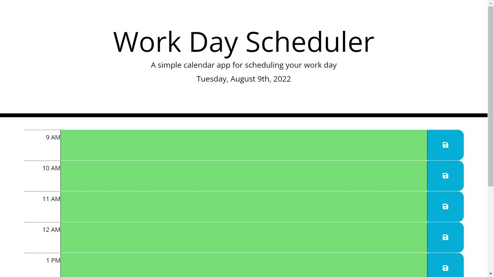

# Work Day Scheduler

## Description
This app allows users to enter, edit, and save events for each hour of the work day. The display indicates past, present, and future time blocks by changing background color. Here is a link to the [deployed page.](https://abi-queen.github.io/Password-Generator/)

## Contributors
I built this app with HTML and CSS starter code from the UC Davis Bootcamp (2022). Tutor Mansi Patel helped me edit some of the JavaScript and JQuery code.
